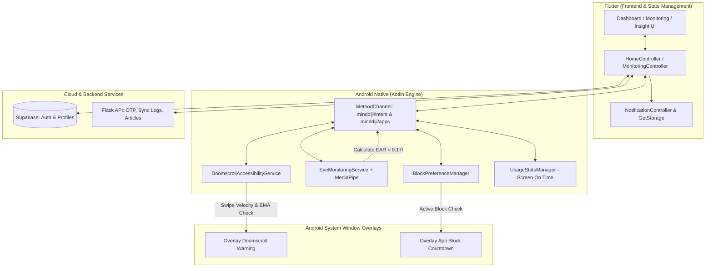

# 🧠 MIND DRIJI - Dokumentasi & Arsitektur Proyek

> [!NOTE]
> **MIND DRIJI** (*"Driji"* dalam bahasa Jawa berarti *"Jari"*) adalah platform asisten kesehatan digital (*Digital Wellness Assistant*) cerdas berbasis **Flutter**, **Android Native (Kotlin)**, dan **AI Computer Vision (Google MediaPipe)** untuk mendeteksi, memantau, dan memitigasi perilaku *doomscrolling* serta kecanduan smartphone secara *real-time*.

---

## 📌 Ringkasan Eksekutif

| Aspek | Keterangan |
|---|---|
| **Judul Proyek** | Deteksi Kecanduan Digital & Doomscrolling Pada Pengguna Smartphone |
| **Kategori** | Digital Wellness, Computer Vision, Behavioral Analytics |
| **Klien / Platform** | Mobile Android (Flutter + Kotlin Native Bridge) |
| **State Management** | GetX Pattern (Reactive State, Dependency Injection, Routing) |
| **Backend Utama** | [Supabase](https://supabase.com) (PostgreSQL Database, Auth, Profiles) |
| **AI / Microservices** | Flask Python API (`https://minddrijiapp.my.id`) |
| **Vision Model** | Google MediaPipe Face Landmarker (`face_landmarker.task`) |

---

## 🏗️ Arsitektur Sistem

Aplikasi ini menggunakan pendekatan **Hybrid Architecture** yang menggabungkan lapisan aplikasi Flutter dengan lapisan layanan sistem Android (*Accessibility Service* & *Foreground Camera Service*) via `MethodChannel`.



---

## 🚀 Fitur-Fitur Utama (Core Capabilities)

### 1. 📊 Smart Monitoring & Screen Time Analytics
* **Pengambilan Data Riil:** Mengambil *Screen On Time* (SOT) langsung dari `UsageStatsManager` sistem Android.
* **Filter Interaktif:** Menampilkan penggunaan harian, mingguan (ISO weeks), dan bulanan dengan grafik batang (*Bar Chart*) interaktif.
* **Breakdown Aplikasi:** Menampilkan daftar aplikasi aktif beserta durasi penggunaan yang telah diskalakan (*scaled proportional usage*).

### 2. 🤖 Live Doomscrolling Detection (EMA Gesture Algorithm)
* **Target Aplikasi:** TikTok, Instagram Reels, YouTube Shorts, Snapchat.
* **Algoritma Deteksi:**
  * Menghitung **Exponential Moving Average (EMA)** kecepatan interval antar-geser (*velocity*).
  * Menghitung volume gesekan (*swipe count*) dan konsistensi arah swipe ke bawah (*consecutive downward swipes*).
  * **Scoring Doomscrolling (0–100):**
    $$\text{Score} = (0.4 \times \text{Speed}) + (0.4 \times \text{Volume}) + (0.2 \times \text{Consistency})$$
* **Status Indikator:** `Rendah` ($< 35$), `Sedang` ($35 - 74$), `Tinggi` ($\ge 75$).
* **Auto-Intervention:** Menampilkan popup overlay peringatan langsung di atas aplikasi ketika melewati ambang batas toleransi.

### 3. 👁️ Eye Fatigue & Strain Detection (Google MediaPipe AI)
* **Layanan Latar Belakang Senyap (*Silent Background Service*):** Berjalan di latar belakang tanpa mengganggu antarmuka pengguna.
* **Kamera Depan + MediaPipe:** Memindai koordinat 468 landmark wajah setiap interval 30 detik (dalam 1 batch = 5 frame).
* **Formula Eye Aspect Ratio (EAR):**
  $$\text{EAR} = \frac{\|p_2 - p_6\| + \|p_3 - p_5\|}{2 \times \|p_1 - p_4\|}$$
* **Threshold Kelelahan:** Jika rata-rata $\text{EAR} < 0.17$, mata diklasifikasikan dalam kondisi **Lelah**, memicu pengurangan skor kesehatan dan push notification peringatan rehat.

### 4. 🚫 Smart App Blocker & Countdown Overlay
* **Blokir Sementara Terjadwal:** Memungkinkan pengguna mengunci aplikasi media sosial selama 15 menit, 30 menit, atau 1 jam.
* **Full-Screen Lock Overlay:** Jika aplikasi yang sedang diblokir dibuka, service langsung memunculkan tampilan kunci layar penuh dengan hitung mundur (*countdown timer*) yang tidak bisa di-bypass.
* **Penyimpanan Status:** Dikelola persisten di `BlockPreferenceManager` (SharedPreferences Android).

### 5. 🧮 Digital Health Score Calculation
Skor kesehatan digital (0–100) dihitung secara real-time pada `HomeController` dengan rumus berbobot:

$$\text{Health Score} = (0.40 \times S_{\text{SOT}}) + (0.30 \times [100 - S_{\text{Doom}}]) + (0.30 \times S_{\text{Eye}})$$

| Komponen | Bobot | Parameter Pengukuran |
|---|---|---|
| **Screen Time ($S_{\text{SOT}}$)** | 40% | Berkurang 2 poin setiap 5 menit kelebihan di atas batas ideal 120 menit. |
| **Doomscrolling ($S_{\text{Doom}}$)** | 30% | Skor kecepatan dan intensitas scroll di media sosial (dibalik logikanya). |
| **Eye Health ($S_{\text{Eye}}$)** | 30% | Berkurang 8 poin saat terdeteksi lelah, bertambah 2 poin saat normal. |

### 6. 💡 Insight, Physical Impact & Articles
* **Estimasi Dampak Fisik:** Menghitung tingkat kelelahan mata (*Eye Fatigue Level*), estimasi defisit jam tidur (*Sleep Deficit Level*), dan kemampuan konsentrasi (*Focus Ability*).
* **Rekomendasi Cerdas:** Memberikan saran spesifik (misal: aturan jeda 20-20-20, filter *blue light*, istirahat total).
* **Edukasi Digital:** Menampilkan artikel hasil *scraping* dari backend Flask.

---

## 📂 Struktur Modul & Berkas Utama

```
lib/
├── main.dart                             # Inisialisasi Supabase, GetStorage, Theme, Routing
├── supabase_config.dart                  # Konfigurasi URL dan Anon Key Supabase
└── app/
    ├── bindings/
    │   └── initial_binding.dart          # Registrasi dependency awal
    ├── data/models/
    │   └── log_model.dart                # Model serialisasi riwayat notifikasi & log
    ├── modules/
    │   ├── home/                         # Dashboard utama & kartu skor kesehatan digital
    │   ├── monitoring/                   # Statistik Screen On Time dan durasi aplikasi
    │   ├── insight/                      # Analisis dampak fisik, rekomendasi AI, dan artikel
    │   ├── eye_monitoring/               # Kalibrasi & preview pemantau mata MediaPipe
    │   ├── app_block_setting/            # Pengaturan blokir aplikasi & kontrol whitelist
    │   ├── notification/                 # Riwayat log aktivitas & alarm peringatan
    │   ├── dashboard/                    # Bottom Navigation Bar pembungkus modul utama
    │   ├── login/ & register/            # Autentikasi Supabase & OTP Flask API
    │   └── profile/ & profile_detail/    # Manajemen profil & preferensi pengguna
    └── routes/
        ├── app_pages.dart                # Daftar GetPage & Binding
        └── app_routes.dart               # Konstanta rute navigasi
```

---

## ⚙️ Komponen Native Android (Kotlin)

```
android/app/src/main/kotlin/com/hn/minddiji/
├── MainActivity.kt                       # MethodChannel handler (minddiji/intent & minddiji/apps)
├── DoomscrollAccessibilityService.kt     # Accessibility service deteksi scroll & overlay
├── EyeMonitoringService.kt               # Foreground service CameraX + MediaPipe Face Landmarker
└── BlockPreferenceManager.kt             # SharedPreferences manager untuk durasi blokir
```

> [!IMPORTANT]
> **Izin Penting Android yang Diperlukan:**
> 1. `PACKAGE_USAGE_STATS` (Usage Access untuk membaca durasi aplikasi & SOT).
> 2. `BIND_ACCESSIBILITY_SERVICE` (Accessibility Service untuk deteksi gesture scroll).
> 3. `SYSTEM_ALERT_WINDOW` (Tampil di atas aplikasi lain untuk popup & countdown lock).
> 4. `CAMERA` & `FOREGROUND_SERVICE_CAMERA` (Pemindaian mata latar belakang).
