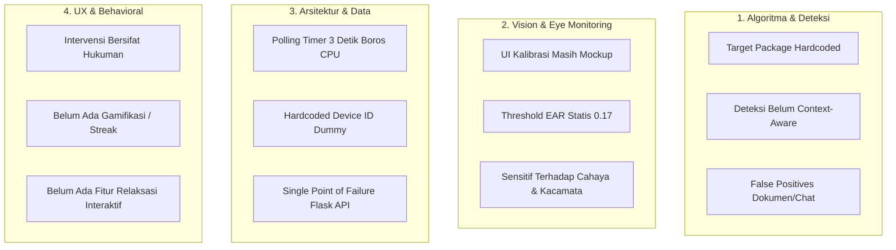
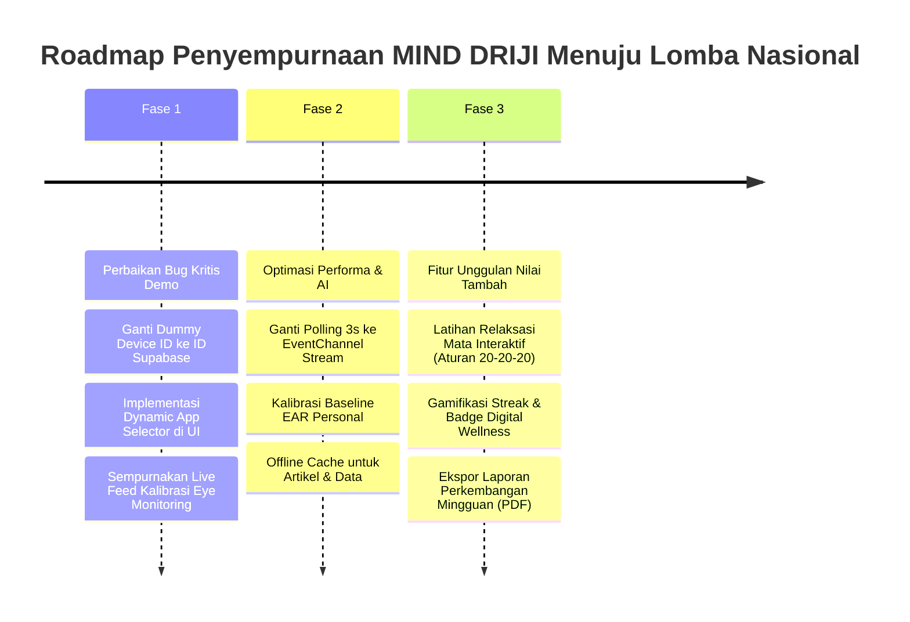

# 🏆 Analisis Kelemahan Sistem & Strategi Pemenangan Lomba Nasional
## Platform: MIND DRIJI (Digital Wellness Assistant)

> [!IMPORTANT]
> Dokumen ini menyajikan audit teknis mendalam, identifikasi titik lemah sistem, evaluasi kriteria penjurian tingkat nasional (GEMASTIK, PKM-KC, LIDM, Hackathon), matriks antisipasi pertanyaan dewan juri, serta rencana aksi (*action plan*) penyempurnaan fitur unggulan.

---

## 📊 Matriks Penilaian Kesiapan Lomba Nasional

| Dimensi Evaluasi | Skor Saat Ini (1–10) | Status | Keterangan & Catatan Kritis |
|---|:---:|:---:|---|
| **Orisinalitas & Inovasi** | **8.5 / 10** | 🟢 Sangat Baik | Menggabungkan Computer Vision (MediaPipe) + Gesture Velocity EMA + System Overlays untuk intervensi real-time. |
| **Kematangan Arsitektur** | **6.5 / 10** | 🟡 Perlu Peningkatan | Komunikasi Native-Flutter masih memakai polling timer 3 detik, payload sync API masih menggunakan dummy ID. |
| **Akurasi & Keandalan AI** | **6.0 / 10** | 🟡 Perlu Peningkatan | Threshold EAR masih statis (0.17f), belum ada kalibrasi baseline mata pengguna, UI kalibrasi masih mock/statis. |
| **Fleksibilitas Sistem** | **5.5 / 10** | 🔴 Kritis | Target aplikasi doomscrolling masih hardcoded di Kotlin (hanya 5 aplikasi). |
| **Dampak Sosial & Perilaku** | **6.5 / 10** | 🟡 Perlu Peningkatan | Intervensi masih bersifat restriktif/hukuman, belum ada gamifikasi / *positive reinforcement*. |
| **Kesiapan Privasi & Etika AI** | **7.5 / 10** | 🟢 Baik | Pemrosesan On-Device Edge AI (kamera tidak diunggah ke cloud), namun perlu penegasan dokumentasi & UI izin. |

---

## 🔍 Audit Mendalam 5 Aspek Kelemahan Sistem

---

### 1. Kelemahan Deteksi & Algoritma Doomscrolling
* **Target Aplikasi Hardcoded (`DoomscrollAccessibilityService.kt`):**
  * Hanya mencakup TikTok, Instagram, YouTube, dan Snapchat.
  * Aplikasi media sosial dan hiburan lain seperti Twitter/X, Facebook Reels, Reddit, Shopee Video, hingga Web Browser (Chrome) tidak terdeteksi.
* **Deteksi Heuristik Belum Adaptif:**
  * Menghitung kecepatan swipe semata tanpa mempertimbangkan konteks konten.
  * *False Positive:* Membaca e-book, scrolling dokumen panjang, atau scrolling obrolan kerja cepat dapat memicu alarm.
  * *False Negative:* Pengguna yang menonton video berdurasi 1–2 menit per konten tanpa sering swipe (konsumsi pasif) tidak terdeteksi sebagai doomscrolling aktif.

---

### 2. Kelemahan Computer Vision & Eye Monitoring
* **Halaman Kalibrasi Masih Statis (`EyeMonitoringView`):**
  * Teks `X: 142 Y: 89 Z: 0.5` dan siluet wajah adalah tampilan mockup visual. Saat diuji oleh juri, halaman ini tidak merespons perubahan gestur atau kedipan mata secara langsung.
* **Threshold EAR Statis ($EAR < 0.17f$):**
  * Bentuk mata manusia sangat bervariasi (mata monolid, sipit, atau lebar). Threshold tunggal menyebabkan pengguna bermata sipit langsung divonis "Lelah" (*False Alarm*).
* **Faktor Lingkungan:**
  * Pencahayaan redup, penggunaan kacamata anti-radiasi, atau sudut kemiringan ponsel sering mengaburkan landmark pupil mata pada MediaPipe.

---

### 3. Kelemahan Arsitektur Komunikasi & Keandalan Sistem
* **Polling Loop 3 Detik (`HomeController`):**
  * Flutter memanggil `_platformChannel.invokeMethod('getLiveDoomscrollData')` setiap 3 detik. Hal ini memboroskan siklus CPU dan baterai.
  * **Solusi Ideal:** Menggunakan `EventChannel` (Stream reaktif satu arah dari Kotlin ke Flutter yang hanya mengirimkan data jika nilai skor/status berubah).
* **Data Sinkronisasi Tercampur (`MonitoringController`):**
  * Payload upload memakai `'device_id': 'user_hp_capstone_123'`. Akibatnya seluruh pengguna uji coba akan mengirim data ke entitas yang sama.
* **Ketergantungan Backend Server Flask:**
  * Registrasi OTP dan fetch artikel bergantung pada server live `https://minddrijiapp.my.id`. Diperlukan penanganan *offline mode* dan *local fallback caching* jika koneksi terputus saat presentasi.

---

### 4. Kelemahan UX & Pendekatan Perilaku Pengguna (*Behavioral Economics*)
* **Intervensi Bersifat Restriktif:**
  * Hanya ada peringatan dan pemblokiran aplikasi. Pola ini memicu *notification fatigue* yang membuat pengguna tergoda mematikan izin aksesibilitas.
* **Ketiadaan Gamifikasi & Penguatan Positif:**
  * Belum ada fitur apresiasi keberhasilan, seperti *Streak Digital Wellness*, *Badge Pencapaian*, atau *Weekly Progress Comparison*.

---

## 🛡️ Matriks Pertahanan Dewan Juri Nasional

| No | Potensi Pertanyaan Kritis Juri | Kelemahan Saat Ini | Jawaban & Solusi Pemenang (Winning Defense) |
|:---:|---|---|---|
| **1** | *"Bagaimana Anda menjamin privasi pengguna jika kamera terus aktif di latar belakang?"* | Kamera aktif di background via Foreground Service. | **On-Device Edge AI:** Jelaskan bahwa frame kamera **100% diproses secara lokal di RAM menggunakan MediaPipe** tanpa pernah disimpan ke penyimpanan lokal ataupun dikirim ke server. Frame langsung di-*recycle* (`bitmap.recycle()`) dalam hitungan milidetik. |
| **2** | *"Bagaimana jika pengguna doomscrolling di aplikasi baru atau web browser?"* | Target aplikasi di-hardcode di kode Kotlin. | **Dynamic App Management:** Tunjukkan fitur di mana pengguna dapat memilih dan menambahkan aplikasi apa pun yang terpasang di ponselnya ke dalam daftar pemantauan (*Custom Target Apps*). |
| **3** | *"Nilai EAR setiap orang berbeda. Mengapa menggunakan patokan tetap 0.17?"* | Threshold bersifat konstan di kode. | **Personalized Baseline Calibration:** Sediakan sesi kalibrasi 5 detik saat pertama kali mengaktifkan fitur untuk merekam nilai EAR normal spesifik pengguna sebagai patokan dinamis. |
| **4** | *"Apa yang membedakan MIND DRIJI dengan fitur Digital Wellbeing bawaan Android/iOS?"* | Fitur bawaan hanya mencatat durasi pasif. | **Real-time Behavioral & Physical Intervention:** Fitur bawaan hanya mencatat jam layar setelah terjadi (reaktif). MIND DRIJI memantau **kecepatan geser (Doomscrolling)** dan **dampak fisik nyata (Kelelahan Mata)** secara langsung saat aktivitas berlangsung (*proaktif*). |

---

## 🚀 Roadmap Penyempurnaan Sistem Menuju Juara

---

## 📋 Rekomendasi Prioritas Aksi (Action Plan)

1. **Prioritas 1: Kesiapan Demo & Integritas Data (Urgent)**
   - [ ] Ubah payload sinkronisasi API dari `user_hp_capstone_123` menjadi `user.id` Supabase aktif.
   - [ ] Buat halaman pengaturan daftar aplikasi target dinamis (bisa memilih aplikasi apa saja dari ponsel).
   - [ ] Hubungkan UI `EyeMonitoringView` dengan pembacaan EAR dan status deteksi asli.

2. **Prioritas 2: Optimasi Arsitektur**
   - [ ] Ganti mekanisme polling 3 detik pada `HomeController` menjadi `EventChannel`.
   - [ ] Tambahkan fitur kalibrasi baseline mata personal (rekam EAR 5 detik awal).

3. **Prioritas 3: Fitur Nilai Tambah Kompetisi**
   - [ ] Buat modul **Interactive Eye Relaxation Guide (Metode 20-20-20)** dengan animasi terpandu.
   - [ ] Tambahkan sistem **Streak Digital Wellness** dan **Export Laporan Mingguan**.
